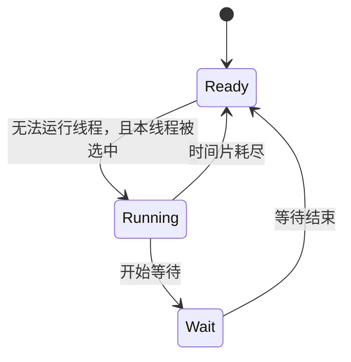
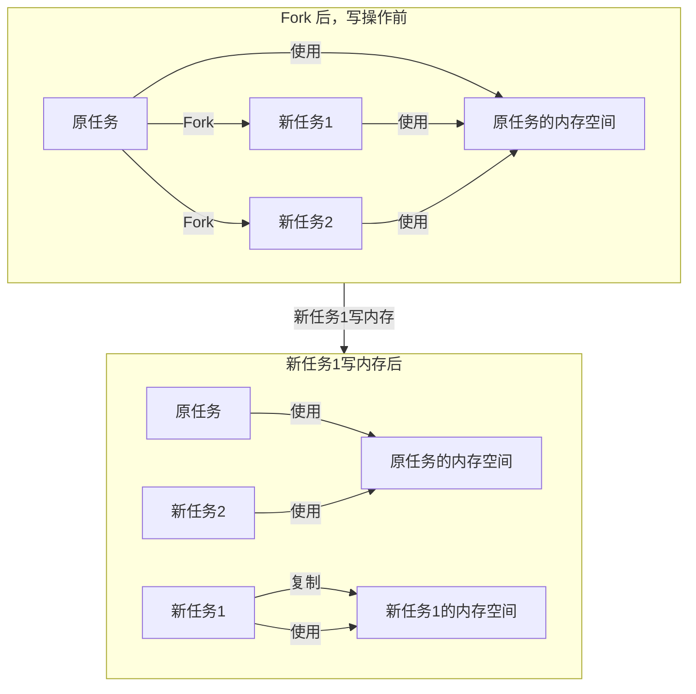

- 对称多处理器 (SMP, Symmetrical Multi-Processing)
- 多核处理器（Multi-core Processor）
- 应用程序接口（Application Programming Interface）
- 系统调用接口（System call Interface）
- 软件中断（Software Interrupt）
- 硬件规格（Hardware Specification）
- 多道程序（Multiprogramming）
- 分时系统（Time-Sharing System）
- 多任务系统（Multi-tasking System）
- 进程（Process）
- 抢占式（Preemptive）
- 硬件驱动（Device Driver）
- 扇区（Sector）
- LBA（Logical Block Address）即整个硬盘中所有的扇区从0开始编号，一直到最后一个扇区，这个扇区编号叫做逻辑扇区号。逻辑扇区号抛弃了所有复杂的磁道、盘面之类的概念。 
- 虚拟地址空间（Virtual Address Space）
- 物理地址空间（Physical Address Space） 
- 分段（Segmentation）基本思路是把一段与程序所需要的内存空间大小的虚拟空间映射到某个地址空间
- 分页（Paging）基本方法是把地址空间人为地等分成固定大小的页，每一页的大小由硬件决定，或硬件支持多种大小的页，由操作系统选择决定页的大小。
- 虚拟页（VP Virtual Page）
- 物理页（PP Physical Page） 
- 磁盘页（DP Disk Page）
- 页错误（Page Fault）
- MMU（Memory Management Unit）

虚拟地址到物理地址的转换

- 线程（Thread）有时被称为轻量级进程（Lightweight Process, LWP）是程序执行流的最小单元。一个标准的线程由线程 ID、当前指令指针（PC）、寄存器集合和堆栈组成。

| 线程私有                      | 线程之间共享 (进程所有)                      | 
| ----------------------------- | -------------------------------------------- | --- |
| 局部变量                      | 全局变量                                     |     |
| 函数的参数                    | 堆上的数据                                   |     |
| TLS(Thread Local Storage)数据 | 函数里的静态变量                             |     |
|                               | 程序代码，任何线程都有权利读取病执行任何代码 |     |
|                               |  打开的文件，A线程打开的文件可以由B线程读写                                            |     |

在单处理器对应多线程的情况下，并发是一种模拟出来的状态。操作系统会让这些多线程程序轮流执行，每次仅执行一小段时间（通常是几十到几百毫秒），这样每个线程就“看起来”在同时执行。这样的一个不断在处理器上切换不同的线程的行为称之为**线程调度** （Thread Schedule）。在线程调度中，线程通常拥有至少三种状态
- 运行（Running）此时线程正在执行
- 就绪（Ready）此时线程可以立刻运行，但 CPU 已经被占用
- 等待（Waiting）此时线程正在等待某一事件（通常是 I/O 或同步）发生，无法执行

处于运行中的线程拥有一段可以执行的时间，这段时间被称为**时间片**（Time Slice） 

线程调度现在主流的调度方式尽管各不相同，但都带有**优先级调度**（Priority Schedule）和 **轮转法**（Round Robin） 的痕迹。
一般把频繁等待的线程称之为 **IO 密集型线程**（IO Bound Thread），而把很少等待的线程称为 **CPU密集型线程**（CPU Bound Thread）。

Linux 将所有执行实体（无论是线程还是进程）都称为**任务（Task）** 每一个任务概念上都类似于一个单线程的进程，具有内存空间、执行实体、文件资源等。不过 Linux 下不同的任务之间可以选择共享内存空间，因而在实际意义上，共享同一个内存空间的多个任务构成了一个进程，这些任务也就成了这个进程里的线程。在Linux下，用一下方法可以创建一个新的任务

| 系统调用 | 作用                                 |
| -------- | ------------------------------------ |
| fork     | 复制当前进程                         |
| exec     | 使用新的可执行映像覆盖当前可执行映像 |
| clone    | 创建子进程并从指定位置开始执行       |

fork 产生新任务的速度非常快，因为fork并不复制原任务的内存空间，而是和原任务一起共享一个**写时复制**（Copy on Write, COW）的内存空间。所谓写时复制，指的是两个任务可以同时自由地读取内存，但任意一个任务试图对内存进行修改时，内存就会复制一份提供给修改方单独使用，以避免影响到其它的任务使用。

fork 只能产生本任务的镜像，因此需要使用 exec 配合才能够启动别的新任务。fork 和 exec 通常用于产生新任务，而如果要产生新线程，则可以使用 clone

##  线程安全 同步于锁

为了避免多个线程同时读写同一个数据而产生不可预料的后果，需要将各个线程对同一个数据的访问**同步**（Synchronization）。所谓同步，即是指在一个线程访问数据未结束的时候，其他线程不得对同一个数据进行访问。

同步最常见的方法是使用锁（Lock）。每个线程在访问数据或资源之前首先试图获取（Acquire）锁，并在访问结束之后释放（Release）锁。

- 二元信号量（Binary Semaphore）
- 互斥量（Mutex）
- 临界区（Critical Section）
- 读写锁（Read-Write Lock）
	- 共享（Shared）
	- 独占（Exclusive） 
- 条件变量（Conditon Variable）

| 读写锁状态 | 以共享方式获取 | 以独占方式获取 |
| ---------- | -------------- | -------------- |
| 自由       | 成功           | 成功           |
| 共享       | 成功           | 等待           |
| 独占       | 等待           | 等待           |
|            |                |                |

## 多线程内部情况

- 一对一模型
	- 一个用户使用的线程唯一对应一个内核使用的线程
		- 由于许多操作系统限制了内核线程的数量，因此一对一线程会让用户的线程数量受到限制
		- 许多操作系统内核线程调度时，上下问切换的开销较大，导致用户线程的执行效率下降
- 多对一模型
	- 多个用户线程映射到一个内核线程上，线程之间的切换由用户态的代码来进行
		- 如果一个用户线程阻塞，那么所有的线程都将无法执行
- 多对多模型