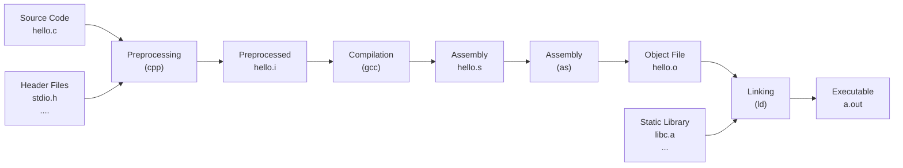
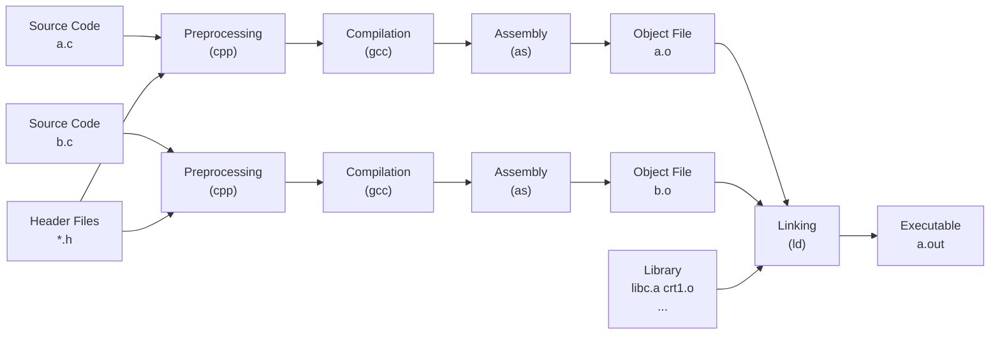
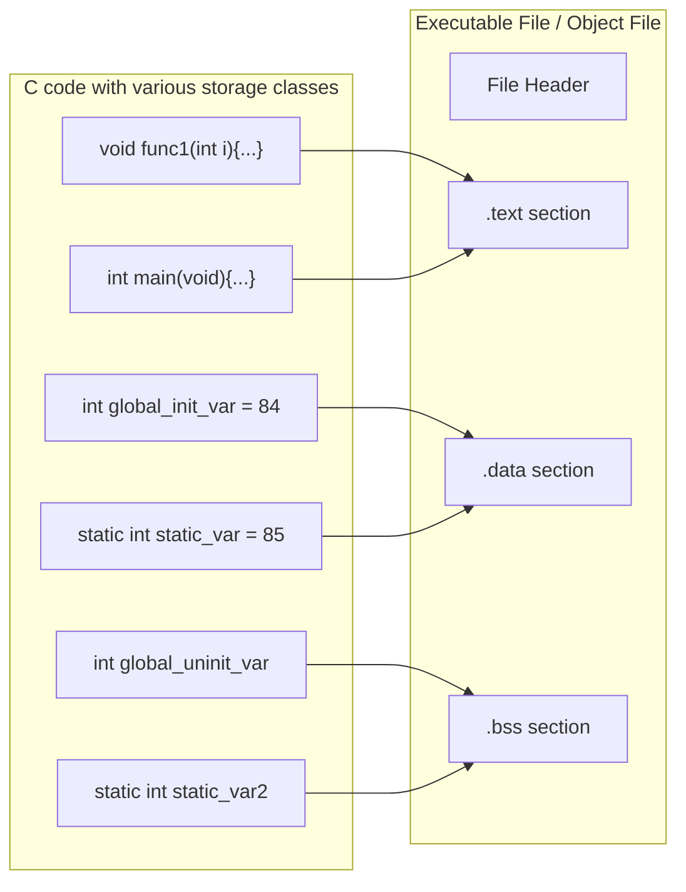
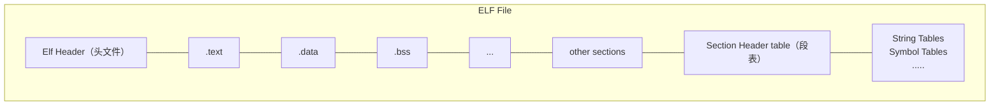

```c
#include <stdio.h>

int main()
{
	printf("Hello World\n");
	return 0;
}
```

```shell
gcc hello.c
./a.out
```

上面的过程分解为4个步骤，分别是**预处理**（Prepressing）、**编译**（Compilation）、**汇编**（Assembly）和**链接**（Linking）。



## 预编译

第一步与预编译的过程相当于如下命令（-E 表示只进行预编译）
`gcc -E hello.c -o hello.i` 或 `cpp hello.c > hello.i`

预编译的处理规则如下
- 将所有的 `#define` 删除，并且展开所有的宏定义
- 处理所有条件预编译指令，比如 `#if`  `#ifdef` `#elif` `#else` `#endif` 
- 处理 `#include` 预编译指令，将被包含的文件插入到该预编译指令的位置。这个过程是递归进行的，也就是说被包含的文件可能还包含其他文件
- 删除所有的注释 `//` 和 `/**/`
- 添加行号和文件名标识，比如 #2 "hello.c" 2, 已便于编译时编译器产生调试用的行号信息及用于编译时产生编译错误或警告时能够显示行号
- 保留所有的 `#pragma` 编译指令，因为编译器需要使用它们 

## 编译

编译过程就是把预处理完的文件进行一系列词法分析、语法分析、语义分析及优化后生产相应的汇编代码文件。上面的编译过程相当于 `gcc -S hello.i -o hello.s`

现在版本的 GCC编译过程分解 GCC 把预编译和编译两个步骤合并成一个步骤，使用一个叫做 ccl 的程序来完成这两个步骤。 我们也可以调用 ccl 来完成  ` /usr/lib/gcc/i486-linux-gnu/4.1.2/cc1 hello.c` 或者使用 `gcc -S hello.c -o hello.s` 都可以得到汇编输出文件 `hello.s` 。

对于 C++ 来说，有对应的程序叫做 cclplus; Objective-C 是 cclobj; fortran 是 f771; Java是 jcl。**所以实际上 gcc 这个命令只是对这些后台程序的包装，它会根据不同的参数要求去调用预编译程序 ccl 、汇编器 as、链接器 ld**

## 汇编

汇编器是将汇编代码转成机器可以执行的指令，每一个汇编语句几乎都对应一条机器指令。 上面的汇编过程可以调用汇编器 as 来完成: `as hello.s -o hello.o` 或 `gcc -c hello.s -o hello.o` 或者使用 gcc 命令从 C 源代码开始经过预编译、编译和汇编直接输出目标文件（Object File）`gcc -c hello.c -o hello.o`

## 链接

```shell
ld -static /usr/lib/crt1.o /usr/lib/crti.o /usr/lib/gcc/i486-linux-gnu/4.1.2/crtbeginT.o -L/usr/lib/gcc/i486-linux-gnu/4.1.2 -L/usr/lib -L/lib hello.o --start-group -lgcc -lgcc_eh -lc --end-group /usr/lib/gcc/i486-linux-gnu/4.1.2/crtend.o /usr/lib/crtn.o
```

## 编译器做了什么？

编译过程一般可以分为 6 步： 扫描、语法分析、语义分析、源代码优化、代码生成和目标代码优化。


### 词法分析

首先源代码程序被输入到**扫描器** （Scanner），扫描器的任务很简单，它只是简单地进行词法分析，运用一种类似于**有限状态机**（Finite State Machine）的算法可以很轻松地将源代码的字符序列分割成一系列的**记号**（Token）

词法分析工具: lex  flex

### 语法分析

语法分析器（Grammar Parser）将对由扫描器产生的记号进行语法分析，从而产生语法树（Syntax Tree）。整个分析过程采用了上下文无关语法（Context-free Grammar）的分析手段，由语法分析器生成的语法树就是以**表达式**（Expression）为节点的树。

语法分析工具: yacc (Yet Another Compiler Compiler) 被称为 “编译器编译器”

### 语义分析

语义分析由语义分析器（Semantic Analyzer）来完成。语法分析仅仅是完成了对表达式的语法层面的分析，但是它并不了解这个语句是否真正有意义。

编译器所能分析的语义是**静态语义**（Static Semantic）所谓静态语义是指在编译期可以确定的语义。
动态语言（Dynamic Semantic）就是只有在运行期间才能确定的语义。


### 中间语言生成

源码级优化器（Source Code Optimizer）在不同编译器中可能会有不同的一定或有一些其它的差异。
源代码优化器往往将整个语法树转换成中间代码（Intermediate Code），它是语法树的顺序表示，其实已经非常接近目标代码了。但是它一般跟目标机器和运行时环境是无关的，比如它不包含数据的尺寸、变量地址和寄存器的名字等。

中间代码有很多种类型，在不同的编译器中有着不同的形式，比较常见的有
- 三地址码（Three-address Code）
- P-代码（P-Code）

中间代码使得编译器可以被分为前端和后端。编译器前端负责产生机器无关的中间代码，编译器后端将中间代码转换成目标机器代码。

### 目标代码生成与优化

源代码级优化器产生中间代码标志着下面的过程都属于编辑器后端。编辑器后端主要包括代码生成器（Code Generator）和目标代码优化器（Target Code Optimizer）

## 链接器

当修改程序指令的时候，每个子程序或目标跳转地址发生改变，需要重新计算各个目标的地址过程被叫**重定位**（Relocation）

## 模块拼装 -- 静态链接 

每个源代码模块独立地编译，然后按照需要将它们“组装”起来，这个组装模块的过程就是**链接**（Linking）。链接的主要内容就是把各个模块之间相互引用的部分都处理好，使得各个模块之间能够正确地衔接。

链接的过程主要包括**地址和空间分配**（Address and Storage Allocation）、**符号决议（Symbol Resolution）** 和**重定位**（Relocation） 等这些步骤。
- 符号决议有时也被叫做符号绑定（Symbol Binding）、名称绑定（Name Binding）、名称绑定（Name Binding）、名称决议（Name Resolution） 、甚至还有叫做地址绑定（Address Binding）、指令绑定（Instruction Binding）的，大体上它们的意思都一样，但从细节角度区分还是有一定的区别。“决议”更倾向于静态链接，而“绑定”更倾向于动态链接。



##  目标文件里有什么

### 目标文件的格式

在PC平台流行的可执行文件格式（Executable）主要是 Windows 下的 PE（Portable Executable）和 Linux 的 ELF（Executable Linkable Format），它们都是 COFF （Common file format）格式的变种。Mac平台下的为 Mach-O 格式。

不光是可执行文件按照可执行文件格式存储。动态链接库(.ddl, .so)及静态链接库(.lib .a) 文件都是按照可执行文件格式存储。

ELF 文件标准里面把系统中采用ELF格式的文件归为如下所列4 类 
| ELF文件类型                     | 说明                                                                                                                                                                                                                             | 实例                                                                  |
| ------------------------------- | -------------------------------------------------------------------------------------------------------------------------------------------------------------------------------------------------------------------------------- | --------------------------------------------------------------------- |
| 可重定位文件 Relocatable File   | 这类文件包含了代码和数据，可以被用来链接成可执行文件共享目标文件，静态链接库也可以归为这一类                                                                                                                                     | Linux 下的.o Win的.obj                                                |
| 可执行文件 Executable File      | 这类文件包含了可以直接执行的程序，它的代表就是 ELF 可执行文件，他们一般都是没有扩展名                                                                                                                                            | 比如 /bin/bash 文件 Win的 .exe                                        |
| 共享目标文件 Shared Object File | 这种文件包含代码和数据，可以在以下两种情况下使用。一种是连接器可以使用这种文件跟其他的可重定位文件和共享目标文件链接，产生新的目标文件。第二种是动态链接器可以将几个这种共享目标文件与可执行文件结合，作为进程映像的一部分来运行 | [[Linux 命令行编辑快捷键]] Linux 的.so 如 /lib/glibc-2.5.so Win的 DLL |
| 核心转储文件 Core Dump File     | 当进程意外终止时，系统可以将进程的地址空间的内容及终止时的一些其它信息转储到核心转储文件                                                                                                                                         | Linux下的 core dump                                                   |

### 目标文件是什么

目标文件包含了编译后的机器指令代码、数据还包括了链接时所需要的一些信息，比如符号表、调试信息、字符串等。一般目标文件将这些信息按不同的属性，以 "节"（Section）的形式存储，有时候也叫“段”（Segment），在一般情况下他们都表示一个一定长度的区域，基本上不加以区别，唯一的区别是在 ELF 的链接视图和转载视图的时候。



ELF 文件的开头是一个“头文件”，它描述了整个文件的文件属性，包括文件是否可执行、是静态链接还是动态链接及入口地址（如果是可执行文件）、目标硬件、目标操作系统等信息，头文件还把包括一个**段表**（Section Table），段表其实是一个描述文件中各个段的数据。段表其实是一个描述文件中各个段的数组。段表描述了文件中各个段在文件中的偏移位置及段的属性等，从段表里面可以得到每个段的具体信息。

- 代码段（Code Section）
	- 程序源代码编译后的机器指令经常存放在这里
	- 常见的名字有 ".code" 或 ".text"
- 数据段（Data Section） 
	- 全局变量和静态变量经常存放到这里
- BSS 段（Block Started by Symbol）
	- 未初始化的全局变量和局部静态变量一般放在 bss 段
	- **该段只是为未初始化的全局变量和局部静态变量预留位置而已**，并没有内容，在文件中也不占据空间


**总体来说，程序源代码被编译以后主要分成两种段：程序指令和程序数据。代码段属于程序指令，而数据段和 .bss 段属于程序数据。**

```text
# objdump -h SimpleSection.o

SimpleSection.o:     file format elf32-i386

Sections:
Idx Name          Size      VMA       LMA       File off  Algn
  0 .text         0000005b  00000000  00000000  00000034  2**2
                  CONTENTS, ALLOC, LOAD, RELOC, READONLY, CODE
  1 .data         00000008  00000000  00000000  00000090  2**2
                  CONTENTS, ALLOC, LOAD, DATA
  2 .bss          00000004  00000000  00000000  00000098  2**2
                  ALLOC
  3 .rodata       00000004  00000000  00000000  00000098  2**0
                  CONTENTS, ALLOC, LOAD, READONLY, DATA
  4 .comment      0000002a  00000000  00000000  0000009c  2**0
                  CONTENTS, READONLY
  5 .note.GNU-stack 00000000  00000000  00000000  000000c6  2**0
                  CONTENTS, READONLY
```


### 自定义段

GCC 提供一个扩展机制，使得程序员可以指定变量所处的段

```c
__attribute__((section("FOO"))) int global = 42;
__attribute__((section("BAR"))) void foo()
{
}
```


## ELF 文件结构描述



ELF 文件头文件及相关常数被定义在 "/usr/include/elf.h" 里

```text
# readelf -h SimpleSection.o
ELF Header:
  Magic:   7f 45 4c 46 01 01 01 00 00 00 00 00 00 00 00 00 
  // 这16个字节对应 Elf32_Ehdr 的 e_ident 这个成员，这16个字节被 ELF标准规定用来标识
  // ELF 文件的平台属性、字节序、ELF文件版本
  // 最开始的 4个字节是所有ELF文件都必须相同的标识码，分别是 0x7F 0x45 0x4c 0x46
  // 0x7F 对应 ASCII 字符里面的 DEL 控制符; 后面3个字节刚好是 ELF 这3个字母的 ASCII 码
  // 这 4 个字节由被称为 ELF 文件的魔数
  // 第5个字节 是标识 ELF 文件类的 0x01 表示是 32 位的 0x02标识是64位的
  // 第6个字节 是字节序，规定是大端还是小端
  // 第7个字节 规定ELF文件的主版本号，一般是1 
  // 后面9个字节 ELF 标准没有定义，一般填 0, 有些平台会使用这9个字节作为扩展标志
  Class:                             ELF32
  Data:                              2's complement, little endian
  Version:                           1 (current)
  OS/ABI:                            UNIX - System V
  ABI Version:                       0
  Type:                              REL (Relocatable file)
  Machine:                           Intel 80386
  Version:                           0x1
  Entry point address:               0x0
  Start of program headers:          0 (bytes into file)
  Start of section headers:          280 (bytes into file)
  Flags:                             0x0
  Size of this header:               52 (bytes)
  Size of program headers:           0 (bytes)
  Number of program headers:         0
  Size of section headers:           40 (bytes)
  Number of section headers:         11
  Section header string table index: 8
```

```c
#define EI_NIDENT (16)

typedef struct
{
  unsigned char e_ident[EI_NIDENT]; /* Magic number and other info */
  // 每个文件类型对应一个常量，系统通过判断这个常量来判断ELF的真正文件类型，而不是通过扩展名
  // ET_REL  1 可重定位文件，一般为 .o 文件
  // ET_EXEC 2 可执行文件 
  // ET_DYN  3 共享目标文件，一般为 .so 文件
  Elf32_Half  e_type;     /* Object file type */
  // 表示ELF文件的平台属性，相关常量以 EM_ 开头
  // EM_M32 1  AT&T WE32100 
  // EM_386 3  Intel x86 
  // ....
  Elf32_Half  e_machine;    /* Architecture */
  Elf32_Word  e_version;    /* Object file version */
  Elf32_Addr  e_entry;    /* Entry point virtual address */
  Elf32_Off   e_phoff;    /* Program header table file offset */
  // 决定段表的位置
  Elf32_Off   e_shoff;    /* Section header table file offset */
  Elf32_Word  e_flags;    /* Processor-specific flags */
  Elf32_Half  e_ehsize;   /* ELF header size in bytes */
  Elf32_Half  e_phentsize;    /* Program header table entry size */
  Elf32_Half  e_phnum;    /* Program header table entry count */
  Elf32_Half  e_shentsize;    /* Section header table entry size */
  Elf32_Half  e_shnum;    /* Section header table entry count */
  Elf32_Half  e_shstrndx;   /* Section header string table index */
} Elf32_Ehdr;
```

### 段表

ELF文件中有很多各种个样的段，这个**段表（Section Header Table）** 就是保存这些段的基本属性的结构。段表是 ELF文件中除了头文件以外最重要的结构，它描述了 ELF 的各个段的信息，比如每个段的段名，段的长度，在文件中的偏移，读写权限及段的其他属性。也就是说，elf 文件的段结构就是由段表决定的，编译器，链接器和装载器都是依靠段来定位和访问各个段的属性的。段表在 ELF文件中的位置由 ELF 文件头的 "e_shoff" 成员决定。

使用 `readelf -S xxx.o` 来查看对表, 段表的结构为一个以 “Elf32_Shdr" 结构体为元素的数组。
`Elf32_Shdr` 又被称为段描述符（Section Descriptor）

```text
# readelf -S SimpleSection.o
There are 11 section headers, starting at offset 0x118:

Section Headers:
  [Nr] Name              Type            Addr     Off    Size   ES Flg Lk Inf Al
  [ 0]                   NULL            00000000 000000 000000 00      0   0  0
  [ 1] .text             PROGBITS        00000000 000034 00005b 00  AX  0   0  4
  [ 2] .rel.text         REL             00000000 000428 000028 08      9   1  4
  [ 3] .data             PROGBITS        00000000 000090 000008 00  WA  0   0  4
  [ 4] .bss              NOBITS          00000000 000098 000004 00  WA  0   0  4
  [ 5] .rodata           PROGBITS        00000000 000098 000004 00   A  0   0  1
  [ 6] .comment          PROGBITS        00000000 00009c 00002a 00      0   0  1
  [ 7] .note.GNU-stack   PROGBITS        00000000 0000c6 000000 00      0   0  1
  [ 8] .shstrtab         STRTAB          00000000 0000c6 000051 00      0   0  1
  [ 9] .symtab           SYMTAB          00000000 0002d0 0000f0 10     10  10  4
  [10] .strtab           STRTAB          00000000 0003c0 000066 00      0   0  1
Key to Flags:
  W (write), A (alloc), X (execute), M (merge), S (strings)
  I (info), L (link order), G (group), x (unknown)
  O (extra OS processing required) o (OS specific), p (processor specific)
```

```c
typedef struct
{
  Elf32_Word  sh_name;    /* Section name (string tbl index) */
  // 表示段的类型 对于编译器和链接器来说，主要决定段的属性的是段的类型和段的标志位
  // 段的类型相关常量以 SHT_ 开头
  // 常量         值   含义
  // SHT_NULL     0  无效段
  // SHT_PROGBITS 1  程序段 代码段 数据段都是这种类型的
  // SHT_SYMTAB   2  表示该段的内容为符号表
  // SHT_STRTAB   3  表示该段的内容为字符串表
  // SHT_RELA     4  重定位表,该段包含了重定位信息
  // SHT_HASH     5  符号表的哈希表
  // SHT_DYNAMIC  6  动态链接信息
  // SHT_NOTE     7  提示性信息
  // SHT_NOBITS   8  表示该段在文件中没内容，比如 .bss 段
  // SHT_REL      9  该段包含了重定位信息 
  // SHT_SHLIB    10 保留
  // SHT_DNYSYM   11 动态链接的符号表
  Elf32_Word  sh_type;    /* Section type */

  // 段的标志位 段的标志位表示该段在进程虚拟地址空间中的属性，比如是否可写，是否可执行等
  // 相关常量以 SHF_ 开头
  // SHF_WRITE     1  表示该段在进程空间中可写
  // SHF_ALLOC     2  表示该段在进程空间中需要分配空间。有些包含指示或控制信息的段不需要在
					  // 进程空间中被分配空间，它们一般不会有这个标志。像代码段 数据段和.bss
					  // 段都会有这个标志位
  // SHF_EXECINSTR 4  表示该段在进程空间中可以被执行，一般指代码段
  Elf32_Word  sh_flags;   /* Section flags */
  
  // 段虚拟地址，如果该段可以被加载，则 sh_addr为该段被加载后在进程地址空间中的虚拟地址；
  // 否则sh_addr 为0
  Elf32_Addr  sh_addr;    /* Section virtual addr at execution */
  
  // 段偏移 如果该段存在于文件中，则表示该段在文件中的偏移；否则无意义
  Elf32_Off   sh_offset;    /* Section file offset */
  Elf32_Word  sh_size;    /* Section size in bytes */
  Elf32_Word  sh_link;    /* Link to another section */
  Elf32_Word  sh_info;    /* Additional section information */
  // 段地址对齐
  // 如果 sh_addralign 为 0 或 1 则表示该段没有对齐要求
  // 由于地址对齐的数量都是2的指数倍， sh_addralign 表示是地址对齐数量中的指数，即
  // sh_addralign = 3 表示对齐为 2 的 3 次方倍，依次类推。所以一个段的地址 sh_addr
  // 必须满足下面的条件，即 sh_addr % (2 ** sh_addralign ) = 0
  Elf32_Word  sh_addralign;   /* Section alignment */
  // 项的长度 有些段包含了一些固定大小的项，比如符号表，它包含的每个符号所占的大小都是一样的，
  // 对于这种段，sh_entsize 表示每个项的大小。如果为0，则表示该段不包含固定大小的项
  Elf32_Word  sh_entsize;   /* Entry size if section holds table */
} Elf32_Shdr;

```

对于系统保留段，属性如下

| Name      | sh_type      | sh_flag                                    |
| --------- | ------------ | ------------------------------------------ |
| .bss      | SHT_NOBITS   | SHF_ALLOC  + SHF_WRITE                     |
| .comment  | SHT_PROGBITS | none                                       |
| .data     | SHT_PROGBITS | SHF_ALLOC  + SHF_WRITE                     |
| .data1    | SHT_PROGBITS | SHF_ALLOC + SHF_WRITE                      |
| .debug    | SHF_PROGBITS | none                                       |
| .dynamic  | SHT_DYNAMIC  | SHF_ALLOC + SHF_WRITE (有些系统没有该标志) |
| .hash     | SHT_HASH     | SHF_ALLOC                                  |
| .line     | SHT_PROGBITS | none                                       |
| .note     | SHT_NOTE     | noen                                       |
| .rodata   | SHT_PROGBITS | SHF_ALLOC                                  |
| .rodata1  | SHT_PROGBITS | SHF_ALLOC                                  |
| .shstrtab | SHT_STRTAB   | none                                       |
| .strtab   | SHT_SYMTAB   | 如果该 ELF 文件中有可装载的段需要用到该字符串表，那么该字符串也将被装载到进程空间，则有 SHF_ALLOC 标志位                                           |
| .symtab   | SHT_SYMTAB   | 同字符串表                                 |
| .text     | SHT_PROGBITS | SHF_ALLOC + SHF_EXECINSTR                  |
|           |              |                                            |

一个重定位表同时也是 ELF 的一个段，这个段的类型（sh_type）就是 SHT_REL 类型的， 它的 sh_link 表示符号表的下标，它的 sh_info 表示它作用于哪个段。


因为字符串的长度往往是不定的，所以用固定的结构来表示它比较困难，一种很常见的做法是把字符串集中起来存放到一个表，然后使用字符串在表中的偏移来引用字符串。这样，在 ELF 文件中引用字符串只须给出一个数字下标即可，不用考虑字符串长度的问题。一般字符串表在 ELF 文件中也以段的形式保存，常见的段名为 .strtab 或 .shstrtab 。 

字符串表（String Table ）.strtab  用来保存普通的字符串
段表字符串表（Section Header String Table） .shstrtab 用来保存段表中用到的字符串

强符号（Strong Symbol） ：对于 c/c++ 语言来说，编译器默认函数和初始化了的全局变量为强符号
弱服务（Weak Symbol） ：编译器未初始化的全局变量为弱符号

可以通过 GCC 的 `__attribute__((weak))` 来定义任何一个强符号为弱符号。
**注意** 强符号和弱符号都是针对定义来说的，不是针对符号的引用。

强引用：对外部目标文件的符号引用在目标文件最终链接成可执行文件时，他们需要正确决议，如果没有找到该符号的定义，链接器就会报符号未定义错误
弱引用：在处理弱引用时，如果该符号有定义，则链接器将该符号的引用决议；如果该符号未定义，则链接器对于该引用不报错。

弱引用和弱符号主要用于库的链接过程。

在GCC中可以通过 `__attribute__((weakref))` 这个关键字来声明对一个外部函数的引用为弱引用。

## 静态链接空间于地址如何分配

采用相似段合并策略，**我们这里谈到的空间分配只关注于虚拟地址空间的分配。**

链接过程分为两步：

- 空间与地址分配： 扫描所有的输入目标文件，并且获得它们的各个段的长度、属性和位置，并且将输入目标文件中的符号表中所有的符号定义和符号引用收集起来，统一放到一个全局符号表。这一步中，链接器将能够获得所有输入目标文件的段长度，并且将它们合并，计算出输出文件中各个段合并后的长度与位置，病建立映射关系。
- 符号解析与重定位：使用上面第一步中收集到的所有信息，读取输入文件中段的数据、重定位信息，并且进行符号解析于重定位、调整代码中的地址等。事实上第二步是链接过程的核心，特别是重定位过程。

#### COMMON 块

当不同的目标文件需要的 COMMON 块空间大小不一致时，以最大的那块为准。现在的链接机制在处理弱符号的时候，采用的就是与 COMMON 块一样的机制。

GCC的 "-fno-common"也允许我们把所有未初始化的全局变量不以 COMMON 块的形式处理，或这使用 `__attribute__ ` 扩展

`int global __attribute__ ((nocommon));`

一旦一个未初始化的全局变量不是以 COMMON 块的形式存在，那么它就相当于一个强符号。
