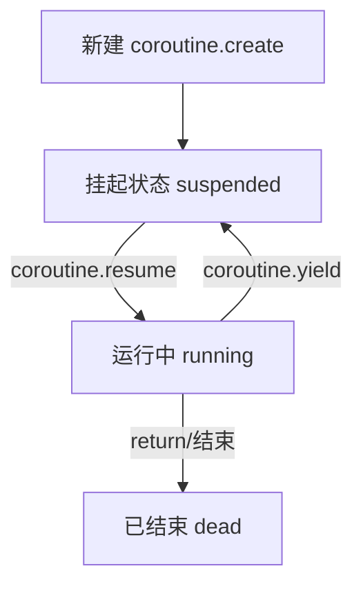

## Lua 的基本内容

### 值和类型

> 8 中基本类型

| 类型     | 说明                                                             |
| -------- | ---------------------------------------------------------------- |
| nil      | nil类型只有一个值,通常表示不存在有用的值                         |
| boolean  | nil 和 false 为假，其余均为真值                                  |
| number   | 整数和浮点数                                                     |
| string   | 不可变的字节序列                                                 |
| function |                                                                  |
| userdata | 用户数据值在 Lua 中无法创建或修改，只能通过 C API 进行创建或修改 |
| thread   | 线程类型                                                         |
| table    | 关联数组                                                         |

> 表、函数、线程和（完整的）用户数据值都是对象 ：变量实际上并不包含这些值，而只是对它们的引用 。赋值、参数传递和函数返回始终操作的是对这些值的引用；这些操作不涉及任何形式的复制。

### 环境和全局变量

> Lua 把你没定义过的变量，都当作是 `_ENV` 这个表里的成员。`_ENV` 就是一个普通的 Lua 表（table），它用来当“作用域环境”。默认这个 `_ENV` 就是 `_G` 也就是平时说的全局变量表。

```lua
-- _ENV 可以被改掉
local _ENV = {print = function() print("你被劫持了") end}


-- 如果要加载一个 lua 脚本，不想让它访问全局变量，可以使用 load / loadfile
local f = load("print(x)", nil, "t", { print = print, x = 123 })
f()  -- 输出 123

-- 这个 { print = print, x = 123 } 就是传给这个脚本的 _ENV，它用来隔离变量作用域
```

### 错误处理

| 功能         | 用法说明                                  |
| ------------ | ----------------------------------------- |
| 抛出错误     | error("错误了")                           |
| 捕获错误     | pcall(function)                           |
| 带堆栈处理器 | xpcall(func, handler)                     |
| 错误值       | 可以是字符串、table、数字……任意值         |
| 警告机制     | 只提示不影响程序运行，从 Lua 5.4 开始支持 |

```lua
-- 抛出错误
--error("发生了致命错误")

-- pcall 捕获错误
local ok, result = pcall(function()
  error("boom")
end)

print(ok)
print(result)

-- 自定义处理错误 xpcall
local function my_func()
  error("出问题了")
end

local function my_handler(err)
  return "捕获错误: " .. err .. "\n" .. debug.traceback()
end

local ok, msg = xpcall(my_func, my_handler)
print(msg)
```

- 自定义错误处理

```lua
local function log_error(msg)
  io.stderr:write("[ERROR] " .. os.date() .. "\n" .. msg .. "\n")
end

function safe_call(fn, ...)
  local args = { ... }

  local function error_handler(err)
    local msg = tostring(err)
    local trace = debug.traceback("", 2)
    local full_msg = "【Lua错误】" .. msg .. "\n" .. trace
    log_error(full_msg)
    return full_msg
  end

  local function wrapped()
    return fn(table.unpack(args))
  end

  local ok, result = xpcall(wrapped, error_handler)
  return ok, result
end


local function demo(a, b)
  return a / b
end

local ok, res = safe_call(demo, 10, 0)
if not ok then
  print("执行失败: ")
  print(res)
else
  print("执行成功,结果是: " .. res)
end
```

### 元表和元方法

> Lua 的 metatables 和 metamethods 允许自定义 lua 对象的行为。

| 项目     | 描述                                                     |
| -------- | -------------------------------------------------------- |
| 元表     | 是一个普通 Lua 表，附加在某个值上，用来定义额外行为      |
| 元方法   | 是元表中特定名称的字段（比如 `__add`），用来触发特殊操作 |
| 作用对象 | 表（table）最常用，也可以用于 full userdata、字符串等    |
| 常见用途 | 模拟类和对象、运算符重载、自定义打印、自定义函数调用等   |
| 获取元表 | getmetatable(x)                                          |
| 设置元表 | setmetatable(t, mt)                                      |

- 示例 让表像函数一样使用(`__call`)

```lua
local t = {}

setmetatable(t, {
	__call = function(self, name)
		print("你好," .. name)
	end
})

t("mako") --> 你好,mako
```

> lua 内置的元方法都有固定的名称，默认以双下划线开头。

| 元表键       | 说明                                                       |
| ------------ | ---------------------------------------------------------- |
| `__add`      | 如果加法运算中的任何操作数不是数字，Lua 就会尝试调用元方法 |
| `__sub`      | 减法（ - ）运算。行为类似于加法运算                        |
| `__mul`      | 乘法运算。行为类似于加法运算                               |
| `__div`      | 除法运算。行为类似于加法运算                               |
| `__mod`      | 取模运算                                                   |
| `__pow`      | 幂运算                                                     |
| `__unm`      | 否定运算                                                   |
| `__idiv`     | 向下取整运算                                               |
| `__band`     | 按位与运算                                                 |
| `__bor`      | 按位或运算                                                 |
| `__bxor`     | 按位异或运算                                               |
| `__bnot`     | 按位非或运算                                               |
| `__shl`      | 按位左移运算                                               |
| `__shr`      | 按位右移运算                                               |
| `__concat`   | 连接(..)操作                                               |
| `__len`      | 长度 (#) 操作                                              |
| `__eq`       | 相等 == 操作                                               |
| `__lt`       | 小于运算                                                   |
| `__le`       | 小于等于                                                   |
| `__index`    | 索引访问 table[key]                                        |
| `__newindex` | 索引赋值 table[key] = value                                |
| `__call`     | 调用操作 func(args)                                        |
| `__gc`       |                                                            |
| `__mode`     |                                                            |
| `__close`    |                                                            |
| `__name`     |                                                            |

### 垃圾回收

- Lua 垃圾回收的核心技巧

| **主题**   | **说明**                                       |
| ---------- | ---------------------------------------------- |
| 自动 GC    | 大多数情况下不用操心，Lua 会帮你清理           |
| 手动优化   | 在高频率创建对象时可主动控制 GC 步进或清理时机 |
| 循环引用   | Lua 可以识别并正确回收                         |
| 弱引用表   | 非常适合做缓存系统，避免“持有太久”             |
| 自定义清理 | 在 userdata + \_\_gc 元方法中定义“析构器”逻辑  |

### 携程

> 协程是轻量级线程，但它不像系统线程那样自动调度，而是你手动控制何时执行、何时暂停。

协程的核心函数有：

- `coroutine.create(fn)`：创建协程
- `coroutine.resume(co, ...)`：启动或恢复协程执行
- `coroutine.yield(...)`：协程主动让出控制权
- `coroutine.status(co)`：获取协程状态
- `coroutine.wrap(fn)`：封装协程为函数调用



## 语言

- 变量命名规则可以包含数字，字母和下划线且不能以数字开头；不能为系统保留关键字
  - 区分大小写
- 按照惯例，程序应避免创建以下划线开头，后跟一个或多个大写字母的名称；如 `_VERSION`
- 系统保留关键字

````
and       break     do        else      elseif    end
false     for       function  goto      if        in
local     nil       not       or        repeat    return
then      true      until     while

- 注释

```lua
-- 这是单行注释

--[[
  多行注释
]]
````

- 字符串字面量

```lua
-- 1. 使用匹配的单引号或双引号
-- 2. 长字符串字面量 以特殊格式 [[ ... ]] 或 [=[ ... ]=] 等形式包围，可以跨行，不解释任何转义序列
a = [[
hello
World"]]
```

### 语句

- 支持多值赋值。多值超出或不足时，自动填 nil 或忽略多余。

```lua
x, y, z = 1, 2          -- z 为 nil
a, b = 3, 4, 5          -- 第三个值 5 被忽略
```

- 局部变量声明使用 `local`
- 控制语句

```lua
-- if

-- while

while condition do
	-- body
end

-- repeat ... until 循环 先执行一次再判断
repeat
	-- body
until condition


-- for 循环数值型
for i = 1, 10, 2 do
  print(i)
end

-- for 循环迭代器
for k, v in pairs(tabl) do
  print(k, v)
end
```
